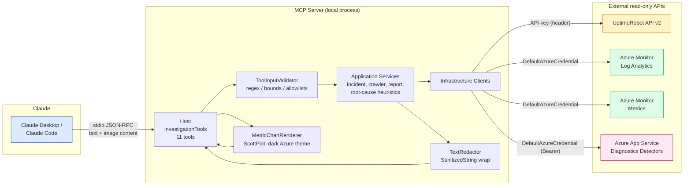
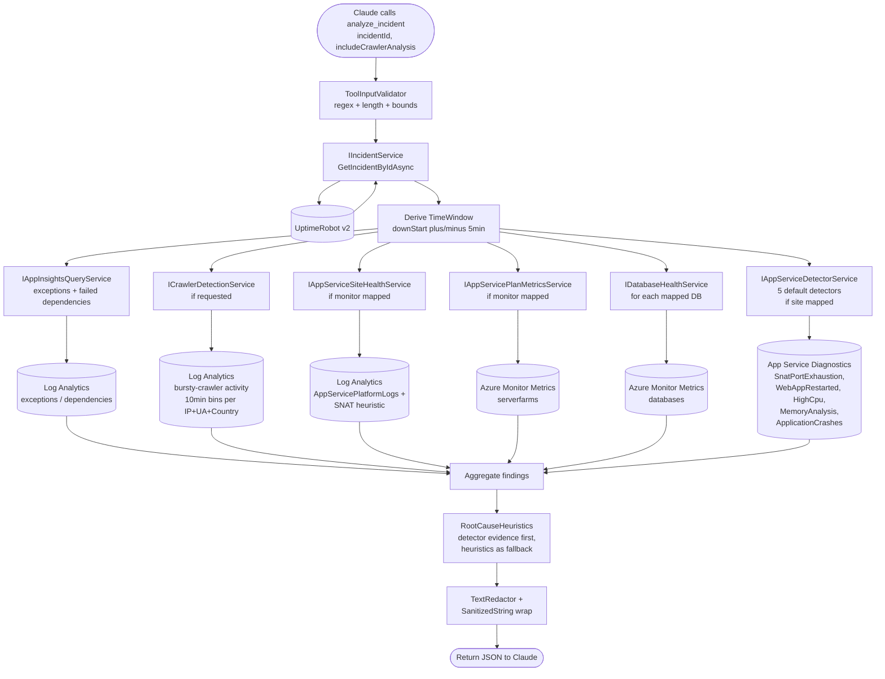
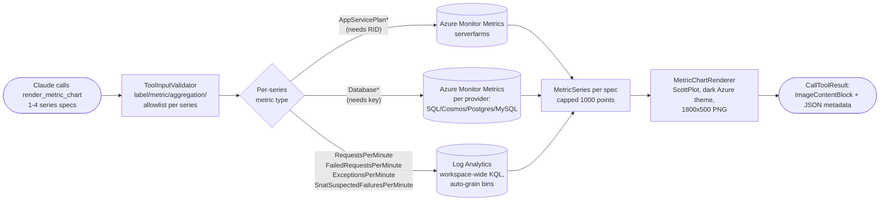

# AzureIncidentInvestigator

A read-only Model Context Protocol (MCP) server in C#/.NET 10 that lets **Claude Desktop** and **Claude Code** investigate website downtime by correlating UptimeRobot incidents with Azure Application Insights telemetry, Azure Monitor infrastructure metrics (App Service Plans, App Service Sites, Databases), and **Azure App Service Diagnostics detectors** — and chart any of it in Azure-portal-style dark-mode line graphs.

This server is **investigation-only**. It cannot mutate Azure resources, execute shell commands, run free-form KQL, fetch arbitrary URLs, or expose secrets to Claude.

---

## What it is / what it isn't

**It IS:**
- A read-only observability assistant for downtime investigation
- A correlator across UptimeRobot + Application Insights + Azure Monitor metrics
- A constrained, typed tool surface — exactly 11 tools, all bounded and parameter-validated
- A local stdio process spawned by your Claude client

**It is NOT:**
- A control plane — no resource modification, no deployment, no scaling
- A shell — no `az`, no PowerShell, no command execution
- A KQL endpoint — no free-form query input
- A generic HTTP client — no `fetch_url`, no SSRF surface
- A secret reader — no `get_config`, no environment exposure

---

## Architecture



### How `analyze_incident` orchestrates a multi-source investigation



### How `render_metric_chart` produces an Azure-style line graph



---

## Prerequisites

| Requirement | How |
|---|---|
| .NET 10 SDK | https://dotnet.microsoft.com/download |
| Azure CLI | `winget install Microsoft.AzureCLI` (or scoop/choco). Then `az login` |
| UptimeRobot read-only API key | UptimeRobot dashboard → My Settings → API Settings → **Read-Only API Key** |
| Azure RBAC | See [Azure RBAC required](#azure-rbac-required) below |
| Claude Desktop or Claude Code | https://claude.ai/download or the VS Code extension |

> **NuGet note:** this repo ships a `nuget.config` that pins the single public `nuget.org` feed (it `<clear/>`s inherited feeds). If your machine has a private/authenticated feed configured globally, this avoids 401 restore failures.

---

## Quick start

```powershell
# 1. Open the solution directory (wherever you cloned it)
cd path\to\AzureIncidentInvestigator

# 2. Sign in to Azure (one-time per machine; token cached for ~24h)
az login

# 3. Store the UptimeRobot API key in user-secrets (never committed)
dotnet user-secrets set "UptimeRobot:ApiKey" "ur-xxxxxxxxxxxxxxxx" --project Host

# 4. Fill in your workspace + allowlists (single config file)
notepad Host\appsettings.json

# 5. Build (copies appsettings.json next to the binaries)
dotnet build

# 6. (Optional) Smoke test — Ctrl+C to exit. No output on stdout until a client connects.
dotnet run --project Host
```

---

## Detailed setup

### 1. Install .NET 10

Download from https://dotnet.microsoft.com/download. Verify with `dotnet --version` (should report `10.x`).

### 2. Sign in to Azure

```powershell
az login
az account show
```

`DefaultAzureCredential` picks up the Azure CLI cached token automatically. If `az account show` succeeds, the MCP server will authenticate. For multiple subscriptions, run `az account set --subscription <id>`.

### 3. Configure the UptimeRobot key

```powershell
dotnet user-secrets set "UptimeRobot:ApiKey" "ur-xxxxxxxxxxxxxxxxx" --project Host
```

The key lives at `%APPDATA%\Microsoft\UserSecrets\websitemonitoring-mcpserver-2026\secrets.json` and is **never** committed.

### 4. Fill in `Host/appsettings.json`

This server uses a **single configuration file** — `Host/appsettings.json`. There is no
`appsettings.Development.json` and no environment switching: the file is loaded by absolute
path from next to the built binaries, so it is read the same way no matter which working
directory the MCP client launches the server from. Edit the relevant sections in place:

```json
{
  "AppInsights": {
    "WorkspaceId": "00000000-0000-0000-0000-000000000000"
  },
  "AppServicePlans": {
    "AllowedResourceIds": [
      "/subscriptions/<sub>/resourceGroups/<rg>/providers/Microsoft.Web/serverfarms/<plan>"
    ],
    "MonitorMappings": { "1234567": "/subscriptions/.../serverfarms/<plan>" }
  },
  "AppServiceSites": {
    "AllowedResourceIds": [
      "/subscriptions/<sub>/resourceGroups/<rg>/providers/Microsoft.Web/sites/<site>"
    ],
    "MonitorMappings": { "1234567": "/subscriptions/.../sites/<site>" }
  },
  "Databases": {
    "Allowed": [
      { "Key": "prod-app-db", "Type": "SqlDatabase",
        "ResourceId": "/subscriptions/<sub>/resourceGroups/<rg>/providers/Microsoft.Sql/servers/<srv>/databases/<db>" }
    ],
    "MonitorMappings": { "1234567": ["prod-app-db"] }
  }
}
```

`MonitorMappings` keys are UptimeRobot monitor IDs (string form). Values are the plan/site resource ID, or a list of database keys, that `analyze_incident` auto-correlates when that monitor's incident is analyzed.

`Databases:Allowed[].Type` accepts: `SqlDatabase`, `SqlElasticPool`, `CosmosDb`, `PostgresFlexible`, `MySqlFlexible`.

> **Note:** `appsettings.json` is committed to source control, so the workspace GUID and
> resource IDs you put here are tracked in git. These are identifiers, not credentials — the
> only real secret (the UptimeRobot API key) stays in user-secrets. After editing the file,
> **rebuild** (`dotnet build`) so the updated copy lands next to the binaries, then reconnect
> the server in your client.

### 5. Build

```powershell
dotnet build
```

### 6. Register with Claude Desktop / Claude Code

Open `%APPDATA%\Claude\claude_desktop_config.json` and add:

```json
{
  "mcpServers": {
    "azure-incident-investigator": {
      "command": "dotnet",
      "args": ["run", "--project", "C:\\path\\to\\AzureIncidentInvestigator\\Host", "--no-build"]
    }
  }
}
```

Restart Claude Desktop. The `azure-incident-investigator` connector should appear with eleven tools.

For Claude Code (CLI), register the same `command`/`args` pair via your MCP configuration.

No `env` block or `cwd` is required — the server loads `appsettings.json` from its own binary
directory and reads the UptimeRobot key from user-secrets, both independent of where the client
starts the process. If you use the `--no-build` arg above, remember to `dotnet build` yourself
after changing `appsettings.json` so the fresh copy is deployed next to the binaries.

#### Production-style alternative (single executable)

```powershell
dotnet publish Host -c Release -r win-x64 --self-contained -p:PublishSingleFile=true -o publish
```

Then point the Claude config `command` at `publish\AzureIncidentInvestigator.Host.exe` with empty `args`.

---

## Tool reference

### 1. `get_recent_downtime_incidents`
**Purpose:** List recent downtime incidents from UptimeRobot.
**Input:** `{ "days": 7 }` — `days` clamped to [1, 30], default 7.
**Output:** `{ "incidents": [ { "id": "1234567:9876543", "monitorName": "prod-site", "downStartUtc": "...", "durationSeconds": 300, ... } ] }`
**Example prompt:** *"Show me downtime incidents from the last 3 days."*

### 2. `analyze_incident`
**Purpose:** Full investigation — exceptions, dependencies, crawlers, plan/site/database health, **App Service Diagnostics detectors**, and root-cause heuristics.
**Input:** `{ "incidentId": "1234567:9876543", "includeCrawlerAnalysis": true }`
**Output:** `{ summary, topExceptions[], failedDependencies[], suspiciousCrawlers[], appServicePlanHealth?, appServiceSiteHealth?, databaseHealth[], appServiceDiagnostics[], possibleRootCauses[], redactedItemsCount }`. Health sections populate only when the incident's monitor is mapped in config. When a site mapping exists, five detectors are auto-queried in parallel: `SnatPortExhaustion`, `WebAppRestarted`, `HighCpu`, `MemoryAnalysis`, `ApplicationCrashes`. Critical/Warning detector findings appear at the top of `possibleRootCauses` ahead of heuristics (detector evidence is platform-authoritative).
**Example prompt:** *"Analyze incident 1234567:9876543 and tell me the most likely root cause."*

### 3. `detect_bad_crawlers`
**Purpose:** Surface suspicious crawler patterns inside a window.
**Detection method:** bins requests into 10-minute windows grouped by `(client_IP, country, user_agent)` and surfaces tuples with > 150 requests/bin. Each candidate's user-agent is then classified (known bot / AI crawler / headless / malformed) and scored.
**Input:** `{ "startTimeUtc": "2026-05-26T00:00:00Z", "endTimeUtc": "2026-05-26T12:00:00Z" }` — both optional (default last 24h), window ≤ 7 days.
**Example prompt:** *"Are there any abusive crawlers in the last 24 hours?"*

### 4. `generate_incident_report`
**Purpose:** Markdown report. Optionally writes to `Reports:OutputDirectory`.
**Input:** `{ "incidentId": "1234567:9876543", "includeCrawlerAnalysis": true, "saveToFile": true }`
**Output:** `{ markdown, fileSavedPath?, redactedItemsCount }`
**Example prompt:** *"Generate a full markdown report for incident 1234567:9876543 and save it."*

### 5. `get_top_exceptions`
**Purpose:** Top exception groups in a window.
**Input:** `{ "startTimeUtc": "...", "endTimeUtc": "...", "top": 20 }` — `top` clamped [1, 100], window ≤ 7 days.
**Example prompt:** *"What were the top 10 exceptions yesterday afternoon?"*

### 6. `get_failed_dependencies`
**Purpose:** Top failed dependencies (outbound calls). Same input shape as `get_top_exceptions`.
**Example prompt:** *"Show me the failed downstream calls during the outage window."*

### 7. `analyze_app_service_plan_health`
**Purpose:** CPU, memory, and queue lengths for an allowlisted plan.
**Input:** `{ "appServicePlanResourceId": "/subscriptions/.../serverfarms/<plan>", "startTimeUtc": "...", "endTimeUtc": "..." }` — resource ID must be in `AppServicePlans:AllowedResourceIds`.
**Example prompt:** *"Was the app service plan saturated during the outage?"*

### 8. `analyze_app_service_site_health`
**Purpose:** Detect app restarts and SNAT-suspected outbound failures for an allowlisted site.
**Input:** `{ "appServiceSiteResourceId": "/subscriptions/.../sites/<site>", "startTimeUtc": "...", "endTimeUtc": "..." }`
**Note on SNAT:** detection is heuristic (outbound dependency failure patterns). Findings are labeled `"suspected"`, not confirmed — definitive SNAT counters require platform diagnostic settings most teams don't enable.
**Example prompt:** *"Did the app restart during the incident? Any SNAT issues?"*

### 9. `analyze_database_health`
**Purpose:** CPU/DTU/memory/connections for an allowlisted database.
**Input:** `{ "databaseKey": "prod-app-db", "startTimeUtc": "...", "endTimeUtc": "..." }` — `databaseKey` must match `Databases:Allowed[].Key`.
**Example prompt:** *"Check `prod-app-db` health during the outage window."*

### 10. `analyze_app_service_diagnostics`
**Purpose:** Query Azure App Service Diagnostics detectors (the "Availability and Performance" panels in the portal). More authoritative than App-Insights heuristics — these come from the platform itself.
**Input:**
```json
{
  "appServiceSiteResourceId": "/subscriptions/.../sites/<site>",
  "detectorKinds": ["SnatPortExhaustion", "WebAppRestarted", "HighCpu"],
  "startTimeUtc": "...",
  "endTimeUtc": "..."
}
```
**Allowlisted detector kinds:** `WebAppDown`, `WebAppSlow`, `HighCpu`, `MemoryAnalysis`, `WebAppRestarted`, `TcpConnections`, `ApplicationCrashes`, `Http4xxErrors`, `SnatPortExhaustion`, `SiteStartupFailures`, `HealthCheck` (max 12 per call).
**Output:** `{ detectors: [{ kind, status: "Healthy|Info|Warning|Critical|Unavailable", statusMessage, insights[] }] }`. `Unavailable` means the detector isn't supported on the site's tier (graceful degradation, not an error).
**Permissions:** `Monitoring Reader` on the site + `Microsoft.Web/sites/detectors/read` (covered by the `Reader` role).
**Example prompt:** *"Run the SNAT and restart detectors on the prod site for the last 2 hours."*

### 11. `render_metric_chart`
**Purpose:** Render a multi-series time-line chart (PNG, **dark Azure-portal theme**, 1800×500) for any chartable metric. Returns the image inline so Claude Desktop/Code can show it directly, plus a JSON metadata blob.
**Input:**
```jsonc
{
  "title": "CPU during incident 1234567:9876543",
  "series": [
    { "label": "Plan CPU avg", "metric": "AppServicePlanCpu",
      "appServicePlanResourceId": "/subs/.../serverfarms/prod-plan",
      "aggregation": "Average" },
    { "label": "SNAT failures/min", "metric": "SnatSuspectedFailuresPerMinute",
      "aggregation": "Average" }
  ],
  "startTimeUtc": "...",
  "endTimeUtc": "...",
  "saveToFile": false
}
```
**Chartable metrics:**
- **Plan** (require `appServicePlanResourceId` allowlisted): `AppServicePlanCpu`, `AppServicePlanMemory`, `AppServicePlanHttpQueue`.
- **Database** (require `databaseKey` allowlisted): `DatabaseCpu`, `DatabaseDtu`, `DatabaseMemory`, `DatabaseConnections`.
- **Application Insights time-series** (workspace-wide, no per-series target): `RequestsPerMinute`, `FailedRequestsPerMinute`, `ExceptionsPerMinute`, `SnatSuspectedFailuresPerMinute`.
**Bounds:** 1–4 series per chart; labels ≤ 64 chars (redacted); window ≤ 7 days; 1000-point cap per series with auto-selected bin grain (1/5/15/60 min).
**Output:** `CallToolResult` with two content blocks — `ImageContentBlock` (the PNG) + `TextContentBlock` (`{ seriesCount, pointCount, savedPath? }`). `saveToFile: true` also writes the PNG into the jailed `Reports:OutputDirectory`.
**Example prompt:** *"Chart the App Service Plan CPU and SNAT-suspected failures together over the incident window."*

---

## Configuration reference

| Key | Type | Default | Purpose |
|---|---|---|---|
| `UptimeRobot:BaseUrl` | string | `https://api.uptimerobot.com/v2/` | API endpoint |
| `UptimeRobot:ApiKey` | string (user-secret) | _none_ | Read-only API key |
| `UptimeRobot:TimeoutSeconds` | int | `10` | Per-request timeout |
| `UptimeRobot:CacheTtlSeconds` | int | `60` | In-memory cache TTL |
| `AppInsights:WorkspaceId` | GUID | _empty_ | Log Analytics workspace GUID |
| `AppInsights:MaxQueryWindowDays` | int | `7` | Hard cap on time-window inputs |
| `AppInsights:QueryTimeoutSeconds` | int | `20` | Per-query timeout |
| `AppInsights:TelemetryColumns:ClientIp` | string[] | `["customDimensions:Client IP Address", "builtIn:client_IP"]` | Where this workspace stores the client IP. Fallback chain. See "Telemetry column config" below. |
| `AppInsights:TelemetryColumns:UserAgent` | string[] | `["customDimensions:User-Agent"]` | Where this workspace stores the user-agent. |
| `AppInsights:TelemetryColumns:Country` | string[] | `["builtIn:client_CountryOrRegion"]` | Where this workspace stores the country. |
| `AppServicePlans:AllowedResourceIds` | string[] | `[]` | Allowlist for the plan tool |
| `AppServicePlans:MonitorMappings` | dict | `{}` | UptimeRobot id → plan resource id |
| `AppServicePlans:CpuWarnThreshold` | int | `80` | CPU % considered warm |
| `AppServicePlans:MemoryWarnThreshold` | int | `80` | Memory % considered warm |
| `AppServiceSites:AllowedResourceIds` | string[] | `[]` | Allowlist for the site tool |
| `AppServiceSites:MonitorMappings` | dict | `{}` | UptimeRobot id → site resource id |
| `Databases:Allowed` | array | `[]` | Allowlisted DBs (Key, Type, ResourceId) |
| `Databases:CpuWarnThreshold` | int | `75` | CPU % considered warm |
| `Databases:ConnectionFailWarnPerMinute` | int | `10` | Connection-failure threshold |
| `Databases:MonitorMappings` | dict | `{}` | UptimeRobot id → list of DB keys |
| `Reports:OutputDirectory` | string | `%TEMP%\AzureIncidentInvestigator\reports` | Single writable directory (temp by default, so generated reports/charts are easy to clear) |
| `RateLimits:PerToolPerMinute` | int | `30` | Token-bucket cap per tool |

### Telemetry column config

Different App Insights workspaces store client IP / user-agent / country in different places — some use the built-in columns (`client_IP`, `client_CountryOrRegion`), some keep them in `customDimensions` because the SDK isn't configured to populate the built-ins (common in custom middleware setups), some have both.

Each `TelemetryColumns:*` setting is an **ordered fallback list**. Each entry is `<source>:<key>` where `<source>` is either `customDimensions` or `builtIn`. The server compiles the list into a safe KQL `coalesce(tostring(...), tostring(...), "")` expression at query time.

```jsonc
"AppInsights": {
  "TelemetryColumns": {
    // Try customDimensions["Client IP Address"] first; fall back to built-in client_IP.
    "ClientIp":  [ "customDimensions:Client IP Address", "builtIn:client_IP" ],

    // Some workspaces use a different cd key (e.g. "Http_User_Agent" from middleware).
    "UserAgent": [ "customDimensions:User-Agent", "customDimensions:Http_User_Agent" ],

    // Country is almost always the built-in.
    "Country":   [ "builtIn:client_CountryOrRegion" ]
  }
}
```

**Validation:** keys are regex-checked at compile time. customDimensions keys may contain `A-Z a-z 0-9 _ - . space` (1–128 chars). Built-in column names must be standard identifiers (`[A-Za-z_][A-Za-z0-9_]*`, 1–64 chars). Anything else — quotes, brackets, semicolons, pipes — is rejected with a clear error before the query runs. This is operator-only config (not Claude-controllable), but the validation prevents bad config from producing broken or unsafe KQL.

**Which queries use these:** `detect_bad_crawlers` (the 10-min × IP × country × UA burst query), the legacy `GetTopUserAgentsAsync`/`GetTopClientIpsAsync` helpers, and any future App Insights query that needs client identity. Pure event-shape queries (top exceptions, failed dependencies, SNAT detection) don't need this — they read schema-native columns directly.

---

## Azure RBAC required

All read-only; **no Contributor or Owner anywhere**.

| Role | Scope | Why |
|---|---|---|
| Log Analytics Reader | Workspace | App Insights queries + AppServicePlatformLogs + chart time-series |
| Application Insights Reader | App Insights resource | Legacy-client compatibility |
| Monitoring Reader | Each allowlisted App Service Plan | CPU / memory / queue metrics + chart series |
| Reader (or Monitoring Reader) | Each allowlisted App Service Site | App Service Diagnostics detectors (covers `Microsoft.Web/sites/detectors/read`) |
| Monitoring Reader | Each allowlisted Database resource | CPU / DTU / connections metrics + chart series |

Grant via Azure Portal: each resource → Access control (IAM) → Add role assignment.

> **Why `Reader` and not just `Monitoring Reader` on sites?** App Service Diagnostics detectors live under `Microsoft.Web/sites/detectors/read`, which is included in the `Reader` role's wildcard `*/read` but not all custom role variants. Use `Reader` for least-friction least-privilege.

---

## Security model

See [`SECURITY.md`](SECURITY.md) for the full threat model. Highlights:

- **Auth boundary:** Claude never sees credentials. Azure CLI cached token + user-secrets API key are resolved inside the server.
- **Input validation:** Every tool parameter is bounded, regex-checked, or allowlisted before any I/O.
- **Output sanitization:** Every external string passes through `TextRedactor` (emails, JWTs, secrets, IPs, query-string tokens) before reaching Claude.
- **Prompt-injection defense:** Telemetry strings are wrapped in `«untrusted» ... «/untrusted»` markers and never interpreted as instructions.
- **No free-form anything:** no KQL, no HTTP, no shell, no filesystem read.
- **Single writable dir:** reports save only to the canonicalized `Reports:OutputDirectory`.

---

## Troubleshooting

**Server starts but Claude can't connect.** The usual cause is **stdout pollution** — anything written to stdout corrupts the JSON-RPC channel. All logs go to **stderr**; verify with `dotnet run --project Host 2>$null` (PowerShell) — you should see nothing on stdout until a client connects.

**`AuthenticationFailedException` from the Azure SDK.** `DefaultAzureCredential` couldn't get a token. Run `az login` and confirm `az account show` succeeds.

**`InvalidOperationException: UptimeRobot:ApiKey is not configured.`** Run `dotnet user-secrets set "UptimeRobot:ApiKey" "ur-xxxx" --project Host`.

**`InvalidOperationException: AppInsights:WorkspaceId is not configured.`** Set a real Log Analytics workspace GUID in `Host/appsettings.json` and rebuild. If you edited the file but the change didn't take effect, you likely ran with `--no-build` without rebuilding — run `dotnet build` so the updated `appsettings.json` is copied next to the binaries.

**`App Service Plan resource ID is not in the allowlist`.** Add the exact resource ID to `AppServicePlans:AllowedResourceIds`.

**`Window must be 7 days or less`.** Raise `AppInsights:MaxQueryWindowDays` if you genuinely need a longer window (slower queries, larger results).

**Empty results.** Either the window is outside data retention, or the workspace ID is wrong. Validate the same query in the Azure Portal Log Analytics blade.

**Rate-limited responses.** Increase `RateLimits:PerToolPerMinute` or wait. Default is 30 calls/min per tool.

**NuGet restore 401 against a private feed.** The bundled `nuget.config` clears inherited feeds and uses only `nuget.org`. Keep it, or add credentials for your private feed if you actually need it.

---

## Extending the server safely

Adding a new tool? Follow this checklist (also in `SECURITY.md`):

1. Add bounded primitive parameters to the tool method (no raw strings that flow into queries).
2. Validate input via `ToolInputValidator` (extend it if needed).
3. If the tool accepts a resource identifier, add an allowlist in config and a validator check.
4. Add the service abstraction in `Application/Abstractions`.
5. Implement it in `Infrastructure` using `MetricsQueryClient`/`LogsQueryClient` with a parameterized KQL template — never accept raw KQL.
6. Wrap returned external strings in `ITextRedactor.Wrap(...)`.
7. Add the tool method to `InvestigationTools.cs` using the `RunAsync` wrapper (logging, rate-limiting, error translation).
8. Unit-test the validator and any pure logic.
9. Update this README and `SECURITY.md`.

Never add: `run_kql`, `fetch_url`, `execute_command`, `read_file`, `get_config`. These are out of scope by design.

---

## Project layout

```
AzureIncidentInvestigator.slnx
Directory.Build.props          # shared build settings
Directory.Packages.props       # central package versions
nuget.config                   # single public nuget.org feed
Domain/                        # pure records / value types (no deps)
Application/                   # service interfaces, validation, redaction, classifier, KQL templates
Infrastructure/                # UptimeRobot + Azure Monitor clients, DI wiring
Host/                          # Program.cs, MCP tools, Serilog, rate limiter, appsettings
Tests/                         # xUnit + FluentAssertions (Application + Domain)
docs/superpowers/              # design spec + implementation plan
```

---

## What this server intentionally cannot do

By design, the following are **absent**, not "TODO":

- ❌ Run arbitrary KQL — only typed methods backed by parameterized templates
- ❌ Fetch arbitrary URLs — no generic HTTP client exposed to tools
- ❌ Execute shell, PowerShell, or `az` commands
- ❌ Read arbitrary files or list directories
- ❌ Return configuration, environment variables, or secrets
- ❌ Mutate any Azure resource (no Contributor / Owner / write APIs)

Each missing capability is a deliberate safety boundary; loosening any one requires a security review and a corresponding update to [`SECURITY.md`](SECURITY.md).
